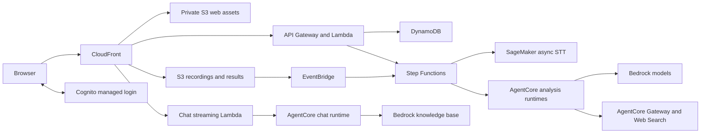

# Meeting Note Analyzer

Meeting Note Analyzer turns meeting recordings and lecture videos into notes you can review and search. It runs in your AWS account, with a React web app, Cognito login, SageMaker transcription, and analysis on Amazon Bedrock AgentCore.

The app uses the CloudFront URL created during deployment. A domain name, Route 53 hosted zone, TLS certificate, and Google OAuth application are not required. Administrators create Cognito accounts; users sign in with their email address and password.

## Features

- **Meeting notes:** upload an MP3 to get a transcript, speaker labels, agenda, detailed notes, follow-up tasks, suggestions, and a mind map.
- **Short meeting brief:** a separate recap of the outcome, decisions and their reasoning, action items, and unresolved questions. Decision explanations include transcript evidence when available.
- **Lecture study:** upload an MP4, optionally with a PPTX or PDF. The pipeline matches screen content with spoken explanations and generates notes, questions, flashcards, and reference links.
- **Paper search:** lecture references are retrieved through the AgentCore Web Search MCP connector and Gateway.
- **Chat:** ask questions about your meeting and lecture material with source references.
- **Background processing:** uploads continue through server-side workflows after the browser closes. Web Push notifications are optional.

The interface is in Korean. Meeting and lecture outputs can be requested in Korean, English, or the source language.

## Architecture



CDK defines separate stacks for storage, authentication, transcription, analysis, lectures, chat, orchestration, API, and web hosting. Local deployment settings and generated AWS identifiers are excluded from Git.

## Prerequisites

- Node.js 22 or newer, Python 3.12 or newer, [uv](https://docs.astral.sh/uv/), and AWS CLI v2.
- Docker with Buildx and support for `linux/amd64` and `linux/arm64` builds.
- AWS credentials allowed to bootstrap CDK and create the resources in this project.
- Bedrock access to the configured Claude models and a SageMaker GPU endpoint quota of at least one instance.
- A Hugging Face read token and access to the transcription and diarization models.

Start with `us-east-1`. Check regional availability for AgentCore Web Search, managed knowledge bases, and the selected models before choosing another region. See [deployment prerequisites](docs/deployment.md#before-you-start) for the service and model requirements.

## Deploy

```bash
git clone https://github.com/mateon01/meeting-note-analyzer.git
cd meeting-note-analyzer
npm ci

# Use your usual AWS CLI profile or SSO session.
aws sso login --profile your-profile
export AWS_PROFILE=your-profile

npm run configure -- --email you@example.com
npm run doctor
npm run bootstrap
npm run secrets
npm run deploy
npm run user:create
```

`configure` writes `deploy.local.json`. `secrets` prompts for the Hugging Face token and generates VAPID keys in Secrets Manager. Passwords and tokens are not stored in the project configuration.

The first deployment prepares the STT models in CodeBuild, creates the application, then applies the generated CloudFront address to Cognito and the backend configuration. CDK displays IAM permission changes for approval. Subsequent deployments reuse the models and update the existing stacks.

`user:create` prompts for a password and creates the first Cognito account. The deploy command prints the CloudFront address to open.

This creates billable resources. Read the [full deployment guide](docs/deployment.md) before starting a deployment.

## Common commands

| Command | Purpose |
| --- | --- |
| `npm run diff` | Review infrastructure changes |
| `npm run deploy` | Build and deploy the application |
| `npm run status` | Show current stack outputs |
| `npm run check:deployment` | Check web configuration and Cognito callback URLs |
| `npm run user:create -- --email teammate@example.com` | Create another login |
| `npm run user:password -- --email teammate@example.com` | Set an existing user's password |
| `npm run models:publish` | Download and publish STT model files again |
| `npm run dev:config` | Prepare ignored configuration for local frontend development |

Use one checkout per AWS account, region, and installation. The deployment helper records that identity locally and rejects accidental switches. Resource names start with `meeting-analyzer` and stack names with `MeetingAnalyzer` by default; change both before the first deployment if needed.

## Development

```bash
npm run typecheck
npm test
npm run test:deploy
npm -w web run build
npm run synth

uv sync --project agents --frozen --extra dev
uv run --directory agents --extra dev pytest -q
uv sync --project lecture --frozen --extra dev
uv run --directory lecture --extra dev pytest -q
uv sync --project stt --frozen --extra dev
uv run --directory stt --extra dev pytest -q
```

For a local frontend connected to your deployed backend:

```bash
npm run dev:config
npm -w web run dev
```

Open `http://localhost:5173`. Vite proxies `/api` to the configured CloudFront endpoint. Cognito allows the localhost callback as well as the deployed application URL. Local development still uses your AWS backend and can incur model and transcription charges.

## Repository layout

| Directory | Contents |
| --- | --- |
| `web/` | React PWA |
| `infra/` | CDK stacks |
| `services/api/` | Authenticated application API |
| `services/pipeline/` | Workflow handlers and notifications |
| `agents/` | Meeting analysis and chat runtimes |
| `lecture/` | Video analysis and study material generation |
| `stt/` | SageMaker transcription container |
| `packages/` | Shared contracts and backend helpers |
| `scripts/` | Deployment, operations, model publishing, and source checks |

## Documentation

- [Deployment](docs/deployment.md): first installation and required access
- [Operations](docs/operations.md): updates, users, model changes, costs, and cleanup
- [Meeting briefs](docs/meeting-brief.md): concise summaries and decision evidence
- [Lecture study](docs/lecture-study.md): MP4 input, optional slides, limits, and search
- [Security](SECURITY.md): authentication, data handling, and reporting
- [Dependency notes](docs/dependencies.md): external services, models, and build dependencies
- [Public release review](docs/public-release-review.md): removed deployment details, checks, and validation limits

## Before publishing a fork

Run `npm run check:public` and a [Gitleaks](https://github.com/gitleaks/gitleaks) scan. Keep `deploy.local.json`, `.deployment/`, CDK outputs, local credentials, recordings, and generated notes out of Git. The public CI workflow runs on GitHub-hosted runners and does not deploy to AWS.
